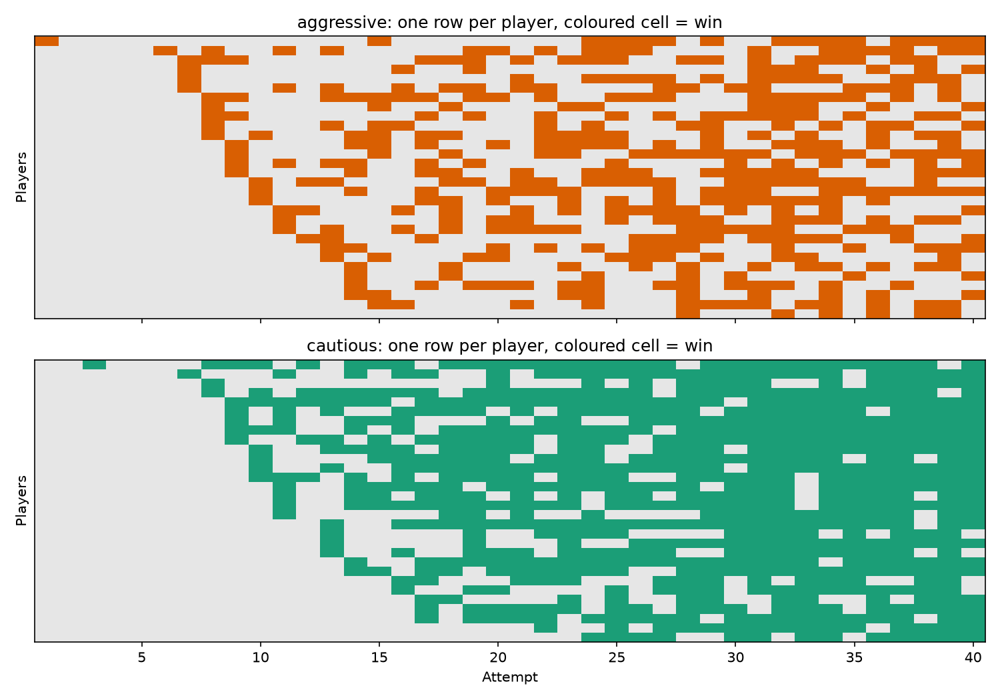
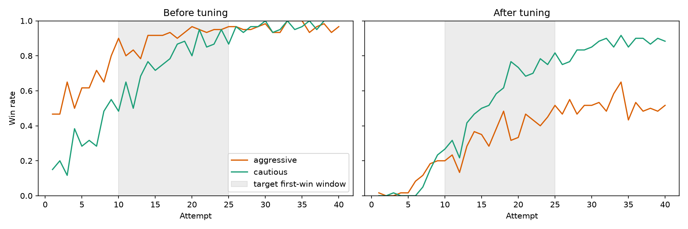

# Design Tuning Copilot

A small Python project that tunes a hard enemy combat encounter with the help of an LLM, the kind players only beat by learning it over many attempts. It simulates playtests, checks the results against design targets, asks Claude for specific tuning changes with reasons, and then simulates again to show whether the changes worked.

The target is a learning curve. Players should rarely beat the enemy in their first few attempts, and most should win for the first time somewhere between attempt 10 and 25. Players learn as they go, and each player learns at their own speed. There are two kinds of player. Aggressive players are quick to win but unreliable, so they keep losing after they have won. Cautious players take a bit longer and then stay steady.

All data in this repo is simulated. Nothing comes from a shipped game.



The chart above shows each player separately, one row per player and one cell per attempt, with a coloured cell for a win. Aggressive players keep slipping after they have won, and cautious players settle. The chart below averages every player before and after tuning.



## Status

- [x] Data formats and sample data
- [x] Combat simulator with players who learn over attempts
- [x] Metrics and comparison against targets, with separate targets for each player type
- [x] LLM tuning suggestions
- [x] Apply suggestions, simulate again, and show a before and after report and chart

## Run it

From the repo root, with Python 3.10 or newer:

```powershell
py -m venv .venv
.venv\Scripts\Activate.ps1
pip install -r requirements.txt
$env:ANTHROPIC_API_KEY = "<your key>"
python -m design_tuning_copilot
```

This does the following:

1. Simulates 60 players per type for 40 attempts each (4,800 fights) and writes `data/telemetry_before.csv`.
2. Asks the LLM for tuning changes, applies them, and simulates again, for up to eight rounds or until every target is met.
3. Prints each round's changes with reasons, plus a before and after summary.
4. Writes `data/telemetry_after.csv`, the tuned settings (`data/enemy_tuned.json` and `data/players_tuned.json`), `learning_curves.png` and `player_view.png`.

The simulator seed is fixed, so the simulated data is the same on every run. The LLM's suggestions can differ between runs, so the tuned settings can too.

## Data files

Everything lives in `data/`.

- `enemy.json` holds the enemy settings: health, damage, approach time range, windup and recovery.
- `players.json` holds the shared player rules (health, damage per hit, heal time, heal amount, number of heals, attack gap, dodge duration and recovery), the learning settings, and the two player types, `aggressive` and `cautious`. Each type has its own heal threshold, volatility, and attack and dodge behavior.
- `targets.json` holds what the designer wants. See the Targets section below.
- `telemetry_before.csv` has one row per fight. The columns are player id, player type, attempt, skill used in that fight, duration, won, damage taken, damage dealt in the enemy's recovery window, heals used, heals interrupted and time spent healing.
- `telemetry_after.csv`, `enemy_tuned.json` and `players_tuned.json` are the same data and settings after tuning. The originals are never overwritten, so every run starts from the same baseline.

## How the simulator works

The enemy repeats four phases: approach, windup, strike and recovery. The approach time is random within a range, and the strike lands at the end of the windup. A fight ends when either side is dead. There is no time limit in the design, only a 10 minute safety stop that a sensible setup never reaches. Time moves in 50 millisecond steps.

**Players learn.** Each player has a skill value between 0 and 1 that grows with every attempt:

```
skill = cap * (1 - (1 - learning_rate) ** (attempt - 1))
```

The cap is 0.9. Each player gets their own learning rate between 0.03 and 0.10, so some learn the fight quickly and some slowly. Both player types share that range.

**Form on the day.** Before each fight, a player's skill gets a random nudge, up or down, so nobody plays at exactly their learned level every time. The size of the nudge depends on the type. Aggressive players have a volatility of 0.20 and cautious players have 0.04. An aggressive player will sometimes play far above their level and sometimes far below it, and a cautious player stays close to it. This is what makes aggressive results spiky from attempt to attempt.

**Attacks.** Once a short gap has passed after a swing, players check every 0.25 seconds and swing with a probability that depends on the enemy's phase and on their skill. Aggressive players swing more often in every phase, including the windup and the approach, and learn to favor the recovery window. Cautious players barely swing outside recovery and learn to wait for it. Swinging commits the player, so they cannot start a dodge until the swing is over. A swing in the approach phase hits nothing, because the enemy is still walking up, but it still commits the player. Swings in the windup and recovery phases deal damage. This is the cost of being reckless: wasted swings leave an aggressive player stuck in a swing when the strike arrives.

**Dodges.** Before each enemy attack, the player decides whether to dodge, and when. They first pick a phase to dodge in, or no dodge at all, and low skill makes "no dodge" and early picks more likely. If they dodge during the windup, they also pick a start time. Beginners tend to dodge right as the windup starts, which gets them hit. With more skill they dodge in the middle to late part of the windup. A dodge protects the player for 1.5 seconds, and then they need 0.5 seconds to recover. They cannot attack during either period.

**Healing.** Players want to heal when their health drops below their type's threshold (25% for aggressive, 50% for cautious), up to a maximum number of heals. They do not heal instantly. They pick a start time somewhere between now and the enemy's next strike, and the lower their skill, the more of that gap they might wait. Beginners sometimes start a heal just before a strike, and experts heal right away in the safe window. A player cannot attack or dodge while healing. If a strike lands during a heal, the heal is cancelled, the player takes the damage, and the heal still counts as used.

**Random numbers.** Every player has their own random number generator, seeded from the run seed, their type and their number. Changing the number of players or attempts does not change anyone else's results. Going from 30 to 60 players per type kept the first 30 players exactly as they were and added 30 new ones.

## Targets

These are defined in `data/targets.json`. Most apply to both player types, and a few are set separately for each type.

Shared by both types:

- The median attempt of the first win should be between 10 and 25.
- At most 10% of players should win before attempt 5.
- At most 10% of players should fail to win in 40 attempts.
- The average time to kill in won fights should be between 80 and 100 seconds.
- The enemy should need 7 to 10 hits to kill the player.
- The player should need 15 to 20 hits to kill the enemy.

Set for each type:

| Target | Aggressive | Cautious |
| --- | --- | --- |
| Late win rate | 50% to 75% | 70% to 90% |
| Relapse rate | 30% to 60% | 10% to 30% |

The late win rate is the share of all fights in attempts 30 to 40 that were wins. Even fully trained players should not win every fight, and a reckless player should lose more often than a careful one. The relapse rate is the share of fights lost after a player's first win. Aggressive players are meant to slip back after beating the enemy, so it has to be visibly higher for them, while cautious players should rarely slip back. These ranges are my own judgment calls, not taken from real data.

The two hit count targets are guardrails. They are worked out from the settings and tie together the enemy's health and damage and the player's health and damage. Without them, the model could make the fight easy or hard just by changing health.

## How the tuning works

1. The simulator generates telemetry and the metrics code builds a report. The report has the current settings, each metric with its target and status (too low, too high or on target), and the results for each player type.
2. The report goes to Claude through the Anthropic SDK, along with a short description of what each setting does. Claude replies with a JSON list of changes. Each change names a parameter, a new value and a reason.
3. Every suggestion is validated. It must use a known parameter from the allowed list and a numeric value, and it must come with a non empty reason. Anything else is rejected.
4. The changes are applied to a copy of the settings, and the simulator runs again with the same seed.
5. This repeats for up to eight rounds. Later rounds see what earlier rounds changed and what happened, so the model can correct course.

The model can change eight settings: the enemy's health, damage, windup time and recovery time, and the player's maximum health, damage per hit, heal amount and number of heals. Everything else is context that it cannot touch: the approach time, heal time, attack timing, dodge settings, learning settings, volatility and the player types.

## Results

Starting settings were enemy health 400, damage 50, windup 3.5 s and recovery 2.5 s, with player health 400, 15 damage per hit and 3 heals of 50. This is far too easy for both types.

| Metric | Aggressive | Cautious |
| --- | --- | --- |
| Median first win | attempt 2 | attempt 4 |
| Win before attempt 5 | 95% | 58% |
| Late win rate (attempts 30 to 40) | 97% | 98% |
| Relapse rate | 11% | 18% |

The player also needed 27 hits to kill the enemy, which is above the guardrail of 20.

The run shown in the charts reached on target settings in six rounds. The enemy's damage went to 58, its windup to 2.0 s and its recovery to 1.5 s. The player's health went to 410, damage per hit to 20, heal amount to 44, and the number of heals to one.

| Metric | Aggressive | Cautious |
| --- | --- | --- |
| Median first win | attempt 10 | attempt 11 |
| Win before attempt 5 | 3% | 2% |
| Late win rate (attempts 30 to 40) | 52% | 88% |
| Relapse rate | 54% | 23% |

Time to kill went from 80.6 s to 95.7 s, enemy hits to kill the player stayed at 8, and player hits to kill the enemy came down from 27 to 20. Every target was met.

The loop does not always get there. Across three runs with 60 players per type, two reached every target (in three and in six rounds), and one used all eight rounds and finished with two aggressive targets missed by a small margin: a median first win of 9.5 against a floor of 10, and 12% of players winning before attempt 5 against a cap of 10%. An earlier run with 30 players per type also used all eight rounds and missed two targets by a hair.

## What I learned

- **The model's predictions are often wrong, so simulating again matters.** In several runs, the model's first round fixed the hit count guardrails by lowering enemy health or raising player damage. It said its other changes would balance this out, but early wins jumped to between 67% and 93%. The simulator caught it and the next round corrected it.
- **Different runs find different valid settings.** One run kept enemy health at 300 and changed windup and heals. Another cut the number of heals to one and raised player damage. The targets describe what good looks like, not one answer.
- **Making two player types look different took several tries.** My first attempt was to add a random swing to each player's skill. It barely changed the averages, because both types faced the same number of hits. Making aggressive players swing more in every phase then made them easier, not riskier, because those swings were free damage. Only when swings in the approach phase stopped dealing damage did aggressive players start taking more hits, winning later and losing more after a win. Per type targets for late win rate and relapse rate then made it possible to describe the difference.
- **A noisy measurement makes the tuner chase noise.** With 30 players per type, medians move in half attempt steps and small setting changes sometimes swung a metric by 20 points or more. The model kept correcting for what was partly noise, and a run could run out of rounds with two targets missed by tiny margins. Doubling the players to 60 helped a lot, though one of three runs at that size still ended with two small misses.
- **The fight has cliffs and flat spots.** In one run the model cut the windup from 2.2 s to 2.1 s, and the aggressive late win rate fell from about 0.6 to 0.27 while time to kill jumped past its cap. In another run, raising the heal amount from 40 to 44 changed nothing at all, because the same fights played out the same way. A dodge plus its recovery takes 2.0 s, so I suspect the cliff is related, but I have not tested that. Small steps do not always give small changes, and the model found the edges by falling off them.
- **Results vary from run to run.** The model is not deterministic, so the same targets can give different settings and sometimes a different outcome.

## Using this with a real game

The simulator is only there to make the project self contained. The rest of the pipeline works on a table of fights, so it can be pointed at real playtest data. Here is how the pieces map onto a real project.

**Telemetry.** `data/telemetry_before.csv` is just one row per fight with a player id, an attempt number, whether the player won, how long the fight lasted and a few other numbers. A real game's playtest or analytics export can be shaped into the same table. The metrics (first win by attempt, win rate by attempt, late win rate, relapse rate, time to kill) only need the player id, attempt, won and duration columns. The other columns are extras.

**Targets.** `targets.json` is where a designer writes down what the encounter should feel like. These numbers are about the design, not the simulator, so they carry over directly. They can also be changed or extended to match what a team cares about, including separate targets for different kinds of player.

**Tunable settings.** The list of settings the model may change (`TUNABLE_ENEMY` and `TUNABLE_PLAYER` in `metrics.py`) and the short notes that explain them (`PARAMETER_NOTES` in `suggestions.py`) would be replaced with the encounter's real tuning values, such as enemy health, damage, attack timings or healing item counts. Anything the model should not touch stays out of the list.

**The simulate again step.** This is the part that does not carry over. In this project, the simulator lets the model's suggestions be tested immediately. With a real game there are two options:

1. **Tune, then playtest.** Take the model's suggestions as hypotheses, change the build, collect a new round of telemetry and run the same report again. This is slower, but it is the real answer, and the project's code would not need to change much beyond reading the new telemetry. Real playtests also have far fewer players than a simulation, so the noise problem above would be bigger, and a team would need to be careful about reading too much into one round.
2. **Build a simulator for the game.** If a team has a fast way to simulate encounters, such as an AI bot or a simplified combat model, it can take the place of `simulator.py`. The important thing is that it produces the same kind of table. This project's simulator is a rough example of that, and its numbers are invented, so a real one would need to be calibrated against real playtests before anyone trusts it.

Either way, the model's suggestions should be treated as a starting point for a designer to review, not as a final answer. The results above show it can miss badly on its own.

**Data privacy.** If the telemetry comes from an unreleased game, check who is allowed to see it before sending anything to an LLM. The report sent to the model contains settings and summary numbers, not raw fights, but those can still be sensitive.

## Limitations

- The dodge rule, the learning curve and the two player personalities are invented, not taken from real combat data.
- Positions are not tracked. A swing in the approach phase simply hits nothing, and swings in the other phases always connect.
- The enemy never reacts to the player. It follows a fixed cycle, so there is no punish for greedy play beyond the committed swing.
- Time moves in 50 millisecond steps.
- Learning is a single number per player. Players do not remember specific enemy attacks.
- Only two player types exist, and they share a learning rate range. They differ in behavior and volatility, not in how fast they learn.
- Healing is a simple rule. Players do not look at the enemy's phase when they heal, they only wait a skill dependent amount of time.
- The targets for each player type are my own estimates, and the results are only as good as those numbers.
- A run is limited to eight rounds, so a hard problem may not be solved.

## What the AI part does and doesn't do

The LLM only proposes tuning changes, each with a reason. It does not know the game, it cannot touch the player model, and every suggestion is checked by simulating again. The results above show why that last step is needed.
